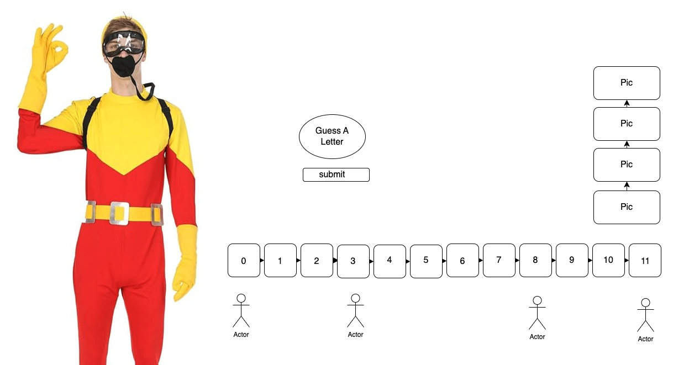

# Title: Scuba-Steve
**Object:** Help Scuba Steve guess the secret word before he has to many skulls. Each letter guessed will be evaluated as truthy/falsy till the game results in a win or a loss.

**Utilization:** Helps build and increase the effective use of Javascript, CSS, and HTML

## Usage - How to play:
1. Players can take turns or work together. 

    >Gameplay continues until the players guess the word or they run out of guesses resulting in the skulls filling their cells.

2. Start guessing letters if you are the player. 

    **Example:** “Is there an 'a' in the word?”

3. Correct guesses will be logged letter by letter.

4. Whenever a player guesses a falsy letter it will be logged as a skull, to increase difficultly for the player and help build mental recall.

5. The player wins when they correctly build the secret word. 
*If the players get every letter of the word before the skulls fill their cells, they've won.*

>***This is a letter by letter game. So fill in the blanks individually guessing mutiple letters or the whole word at once will be logged wrong and a skull strike against you.***

## Getting started:

Link: ``` animatedscub-joke.surge.sh ```

## Development Setup & Tools
Begin by designing a wireframe of how you would like the game to appear.
Create an game flow outline for your game.
Begin developing out your HTML to tie your other technologies to.
Brainstorm the variables needed and functions for each step to add into your Javasript code.
After testing that the HTML and Javascript are functioning together properly and that any issues with our functions are resolved we can move on to the design aspect CSS Style.

### Technologies used:
1. Javascript
2. CSS
3. HTMl
4. VEED.io (mp4)

### Steps to making the code:
1. Start with creating ("let") variables that are able to change throughout the game, that help you log your correct and wrong guesses.
2. Next make ("const") variables that do not change throughout the game to help set limits on the amount of wrong guesses, hold values, and set arrays.
3. Be sure to define a wordBank array that holds the words used in the game.
4. Creata a function that will randomly select words from that bank.
5. To trigger the game, create an event listener that initiates the game logic when clicked.
6. The listener will be the core operator of our game and manager of the game flow.
    * It will check the input guessed to see if it matches any words in the secret word. If there is a match the board display will update with the letter inside the correct tile. 
    * If the input guessed is incorrect, the wrong guess will count a strike against you. With each incorrect guess the listener is checking if the maximum wrong number has been reached.
    * As the event listener is managing the game when the game has ended with either a winner or a loser, the game will trigger a delayed restart.
7. Create a function called ("restart()") that reloads the page when the game has resulted in a winner or a loser.

## Features & Possible Future Enhancements:
**Current features:**
1. Set timers that reload the page after the game has ended.
2. An MP4 video clip that deploys when the game has ended in a loss.
3. When the game has been won, confetti is shot off and an MP4 song is played for the winner.

**Possible Future Enhancements:**
* Tie specific songs and videos to play for specific words in the word bank.
* Include different lengths of words for the bank to pull from.
* Include hints as the difficulty in the game increases.

## Attributions & Resources:
For more information on hangman games, source credit: [Wiki](https://www.wikihow.com/Play-Hangman)

For more uses of confetti and muniplation of them, source credit: [Confetti](https://confetti.js.org/more.html)

For more information on set timers, source credit: [Mdn](https://developer.mozilla.org/en-US/docs/Web/API/setTimeout)

For more information on media and video files, source credit: [Mdn](https://developer.mozilla.org/en-US/docs/Web/Media/Autoplay_guide)

Background image from: [Wallpapercave](https://wallpapercave.com/w/wp10846526)

Image and video contect attached to background credited from the movie ***Big Daddy*** produced by Columbia Pictures, Jack Giarraputo Productions, and Out of the Blue Entertainment.

Attached audio content credited from Fergie performing Fergalicious produced by A&M Records.

# Finished product screenshot:
